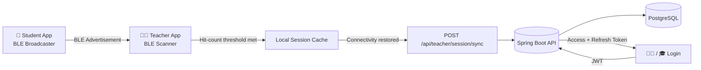
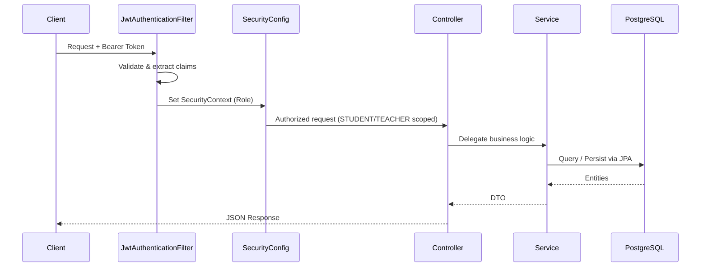
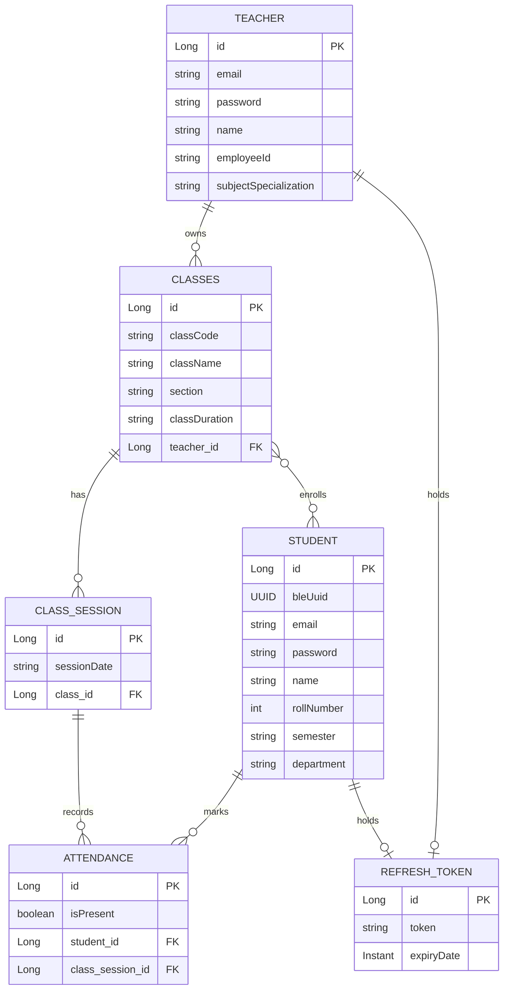

<div align="center">

# 📡 Attendify — Backend Server

### BLE-Powered Smart Attendance System — REST API

Backend server for **Attendify**, a Bluetooth Low Energy (BLE) based smart attendance system that lets teachers create classes and take contactless attendance automatically as students walk into range — no manual roll calls, no QR codes, no biometric hardware.

[](https://openjdk.org/)
[](https://spring.io/projects/spring-boot)
[](https://spring.io/projects/spring-security)
[](https://www.postgresql.org/)
[](https://jwt.io/)
[](https://maven.apache.org/)
[](#license)

[Overview](#-overview) •
[Architecture](#-architecture) •
[Tech Stack](#-tech-stack) •
[Getting Started](#-getting-started) •
[API Reference](#-api-reference) •
[Database Schema](#-database-schema) •
[Roadmap](#-roadmap)

</div>

---

## 📖 Overview

Attendify replaces manual and proxy-prone attendance systems with an automated **BLE broadcast/scan model**:

- 👨‍🏫 **Teachers** create a class session; their device starts scanning for nearby student beacons.
- 🎓 **Students** broadcast a unique BLE identifier in short cycles from their phone in the background.
- 📶 When a teacher's device detects a student's beacon enough times (hit-count threshold) during the session window, that student is marked **present** — automatically.
- 📴 Sessions taken while offline are cached locally on the Android client and **synced in bulk** to this backend the moment connectivity returns.

This repository is the **Spring Boot REST API** that the [Attendify Android client](https://github.com/aetherRohan/attendify-smart-attendance-app) talks to. It owns authentication, class/roster management, session lifecycle, and attendance persistence.

> 📱 **Companion repo:** [`attendify-smart-attendance-app`](https://github.com/aetherRohan/attendify-smart-attendance-app) — Kotlin + Jetpack Compose Android client that handles the actual BLE broadcasting/scanning.

---

## 🏗 Architecture

### High-level flow



### Request lifecycle (JWT auth)



### Layered structure

```
Controller  →  Service  →  Repository  →  Entity  →  PostgreSQL
   ↑                            
  DTOs (request/response contracts, never expose entities directly)
```

---

## 🛠 Tech Stack

| Layer | Technology |
|---|---|
| **Language** |  |
| **Framework** |  |
| **Security** |   |
| **Persistence** |   |
| **Database** |  |
| **Build Tool** |  |
| **Boilerplate** |  |
| **Dev Tools** |  |

---

## 📂 Project Structure

```
attendify-backend-server/
└── src/main/java/com/attendifyserver/attendifyserver/
    ├── config/                    # Security, JWT, and app-level beans
    │   ├── ApplicationConfig.java
    │   ├── CustomUserDetails.java
    │   ├── JwtAuthenticationFilter.java
    │   ├── JwtService.java
    │   ├── RefreshTokenService.java
    │   ├── SecurityConfig.java
    │   └── UserDetailsImpl.java
    ├── controller/                # REST endpoints
    │   ├── AuthController.java
    │   ├── StudentClassController.java
    │   └── TeacherClassController.java
    ├── dto/                       # Request/response contracts
    ├── entity/                    # JPA entities
    │   ├── Attendance.java
    │   ├── ClassSession.java
    │   ├── Classes.java
    │   ├── RefreshToken.java
    │   ├── Student.java
    │   └── Teacher.java
    ├── enums/
    │   └── Roles.java             # STUDENT, TEACHER
    ├── repository/                # Spring Data JPA repositories
    ├── service/                   # Business logic
    │   ├── AttendanceService.java
    │   ├── AuthenticationService.java
    │   ├── ClassService.java
    │   ├── ClassSessionService.java
    │   └── StudentService.java
    └── util/
        └── ClassCodeGenerator.java # Generates unique 7-char join codes
```

---

## 🚀 Getting Started

### Prerequisites

- ☕ **Java 21+**
- 🐘 **PostgreSQL** (running locally or remote)
- 📦 Maven (or use the bundled `./mvnw` wrapper — no local install needed)

### 1. Clone the repository

```bash
git clone https://github.com/aetherRohan/attendify-backend-server.git
cd attendify-backend-server
```

### 2. Configure environment

Create `src/main/resources/application.properties` (this file is gitignored — you must create it yourself):

```properties
# Server
server.port=8080

# Database
spring.datasource.url=jdbc:postgresql://localhost:5432/attendify_db
spring.datasource.username=your_pg_username
spring.datasource.password=your_pg_password
spring.jpa.hibernate.ddl-auto=update
spring.jpa.show-sql=true

# JWT
application.security.jwt.secret-key=your_base64_encoded_secret_key
application.security.jwt.expiration=86400000
application.security.jwt.refresh-token.expiration=604800000
```

> 🔑 Generate a secure Base64 HS256 key for `secret-key`, e.g.:
> ```bash
> openssl rand -base64 32
> ```

### 3. Create the database

```sql
CREATE DATABASE attendify_db;
```

### 4. Run the application

```bash
# Linux / macOS
./mvnw spring-boot:run

# Windows
mvnw.cmd spring-boot:run
```

The API will be live at **`http://localhost:8080`**.

### 5. Build a production JAR

```bash
./mvnw clean package
java -jar target/attendifyserver-0.0.1-SNAPSHOT.jar
```

---

## 📡 API Reference

All endpoints are prefixed with `/api`. Endpoints under `/api/auth/**` (except signup/login/refresh) and role-scoped routes require a `Bearer <JWT>` header.

### 🔐 Auth — `/api/auth`

| Method | Endpoint | Access | Description |
|---|---|---|---|
| `POST` | `/api/auth/signup/student` | Public | Register a new student account |
| `POST` | `/api/auth/signup/teacher` | Public | Register a new teacher account |
| `POST` | `/api/auth/login` | Public | Authenticate and receive access + refresh tokens |
| `POST` | `/api/auth/refreshToken` | Public | Exchange a valid refresh token for a new access token |

### 🎓 Student — `/api/student` (requires `STUDENT` role)

| Method | Endpoint | Description |
|---|---|---|
| `POST` | `/class/joinClass?classCode={code}` | Join a class using the teacher-shared join code |
| `GET` | `/class/getClasses` | List all classes the student is enrolled in |
| `GET` | `/class/getAllClassSession?classId={id}` | Get all sessions held for a class |
| `GET` | `/classSession/getAttendance?classId={id}&studentId={id}` | Get a student's attendance record for a class |

### 👨‍🏫 Teacher — `/api/teacher` (requires `TEACHER` role)

| Method | Endpoint | Description |
|---|---|---|
| `POST` | `/class/createClass` | Create a new class (auto-generates a unique join code) |
| `GET` | `/class/{classId}/students` | List all students enrolled in a class |
| `GET` | `/class/getClasses` | List all classes owned by the teacher |
| `GET` | `/class/classSession?classId={id}` | List all sessions held for a class |
| `GET` | `/classSession/getAllAttendances?classSessionId={id}` | Get full attendance sheet for a session |
| `POST` | `/session/sync` | Bulk-sync offline-recorded BLE sessions (idempotent — duplicate session dates are skipped) |

<details>
<summary>📥 Sample request — <code>POST /api/teacher/class/createClass</code></summary>

```json
{
  "className": "Data Structures & Algorithms",
  "section": "CSE-B",
  "classDuration": "59"
}
```

**Response**
```json
{
  "id": 12,
  "classCode": "K9F3XQ2",
  "className": "Data Structures & Algorithms",
  "section": "CSE-B"
}
```
</details>

<details>
<summary>📥 Sample request — <code>POST /api/teacher/session/sync</code></summary>

```json
[
  {
    "classId": 12,
    "sessionDate": "2026-07-10",
    "presentStudentIds": [101, 104, 107]
  }
]
```
</details>

---

## 🗄 Database Schema



**Key design notes:**
- Every `Student` gets a **server-generated BLE UUID** on creation (`@PrePersist`) — this is the identifier broadcast over Bluetooth and matched by teacher devices.
- `Classes.classCode` is a unique 7-character alphanumeric code (`ClassCodeGenerator`) guaranteed to contain at least one letter and one digit, used by students to join.
- `(student_id, class_session_id)` is a **unique constraint** on `Attendance` — a student can only have one attendance record per session.
- `(class_id, sessionDate)` is unique on `ClassSession`, making the offline sync endpoint naturally idempotent against duplicate resubmissions.

---

## 🔒 Security Model

- **Stateless JWT authentication** — no server-side sessions (`SessionCreationPolicy.STATELESS`)
- **Role-based route authorization** enforced at the security-filter level:
  - `/api/student/**` → requires `STUDENT` authority
  - `/api/teacher/**` → requires `TEACHER` authority
- **Access + refresh token pair** issued on login; refresh tokens are persisted and validated server-side (`RefreshTokenService`)
- Passwords are never stored in plaintext (`PasswordEncoder` via `ApplicationConfig`)

---

## 🗺 Roadmap

- [ ] Move `studentId` resolution in attendance endpoints from request params to the authenticated JWT principal (harden against ID spoofing)
- [ ] Add explicit CORS configuration for cross-origin Android/web clients
- [ ] Add request-body validation (`@Valid` + Bean Validation) on all DTOs
- [ ] Global `@ControllerAdvice` exception handler to remove repeated try/catch blocks in controllers
- [ ] OpenAPI/Swagger documentation
- [ ] Dockerize for containerized deployment
- [ ] CI pipeline (GitHub Actions) for build + test on push

---

